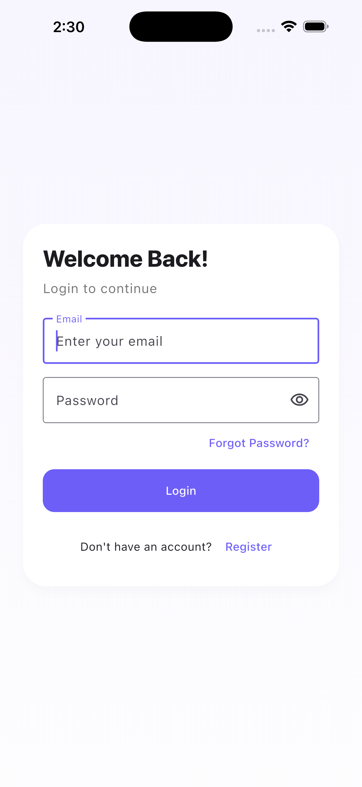
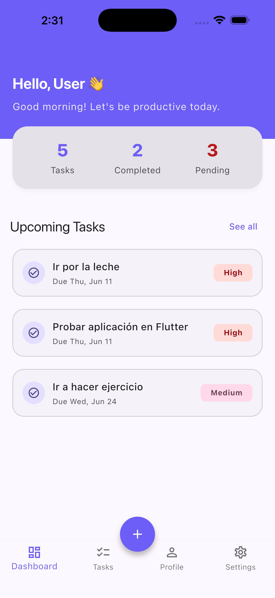
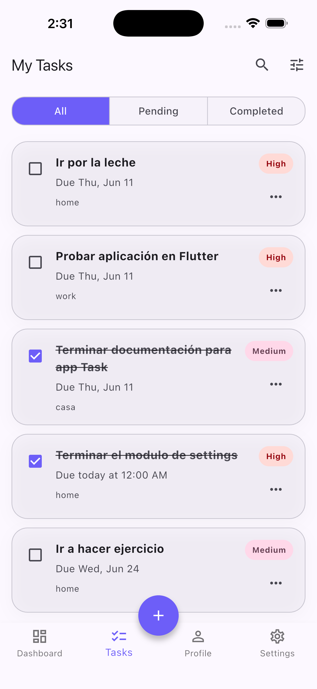
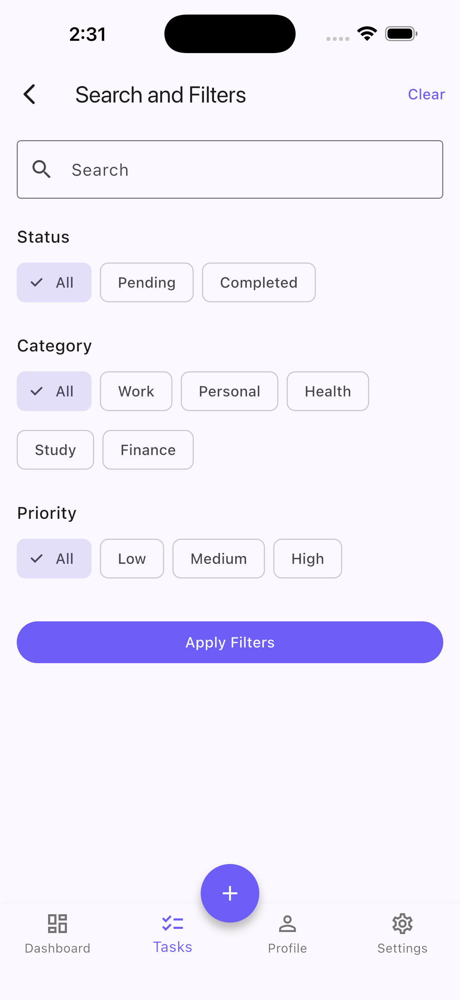
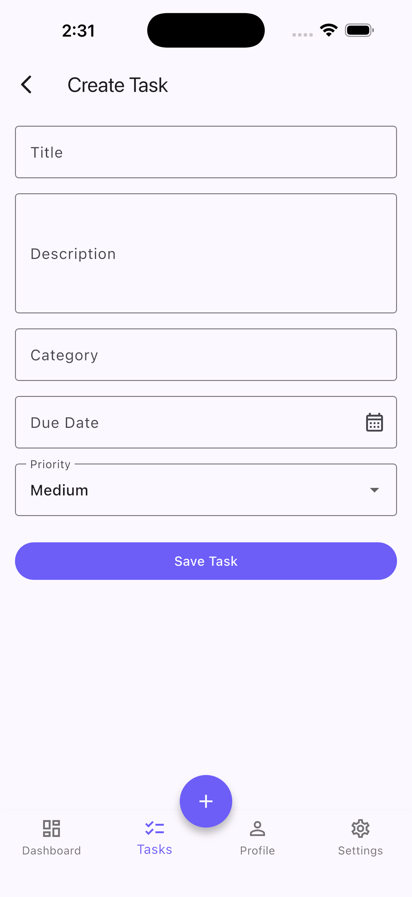
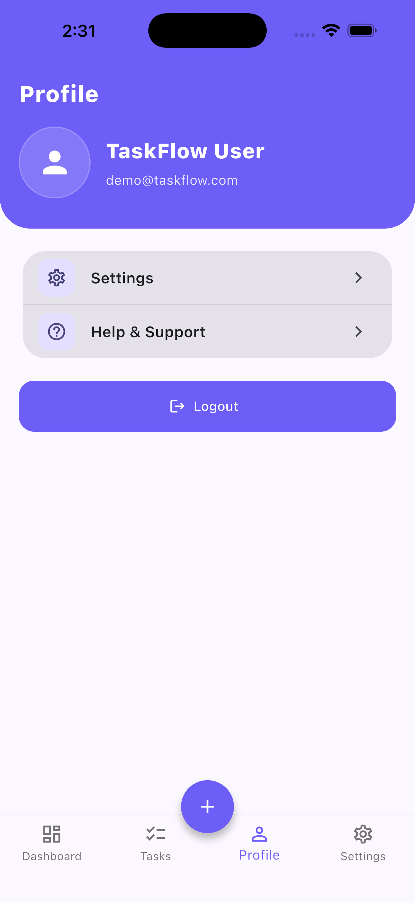
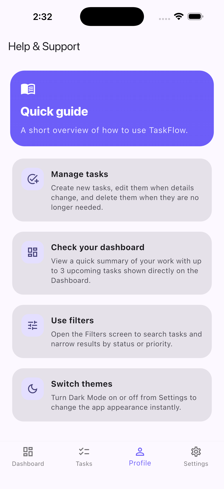

# TaskFlow

TaskFlow is a Flutter task management app built with Material 3, Provider, GoRouter, and Supabase. It supports authentication, task CRUD, filtering, profile access, a help guide screen, and local settings persistence for dark mode.

## Project Overview

TaskFlow helps users manage their personal and work tasks in one place. The app uses a clean layered architecture:

- Presentation layer for pages, widgets, and state management
- Domain layer for entities and repository contracts
- Data layer for repository implementations and data models

The app currently uses Supabase for authentication and task storage, and `SharedPreferences` for local dark mode settings.

## Features

- Email and password authentication with Supabase Auth
- Task dashboard with task list management
- Create, edit, delete, and search tasks
- Filter tasks by status and priority
- Profile screen with account details and logout
- Settings screen with dark mode toggle
- Help & Support screen with a short in-app guide
- Material 3 theming

## Architecture

TaskFlow follows a simple clean architecture approach:

### Presentation

Widgets, pages, and `ChangeNotifier` providers live in `lib/features/*/presentation`.

### Domain

Core business entities and repository contracts live in `lib/features/*/domain`.

### Data

Repository implementations, models, and remote data access live in `lib/features/*/data`.

### App Layer

Shared app configuration, routing, navigation, and theming live in `lib/app`.

## Technologies

- Flutter
- Dart
- Provider
- GoRouter
- Supabase Flutter
- SharedPreferences

## Project Structure

```text
lib/
  app/
    app.dart
    navigation/
    router/
    theme/
  core/
    config/
    errors/
    services/
    utils/
    widgets/
  features/
    auth/
    dashboard/
    profile/
    settings/
    tasks/
test/
```

Key files:

- `lib/main.dart` initializes Supabase and starts the app
- `lib/app/app.dart` wires providers and app-level theming
- `lib/app/router/app_router.dart` defines navigation
- `lib/features/tasks/presentation/providers/task_provider.dart` manages task state
- `lib/features/settings/presentation/providers/settings_provider.dart` manages the dark mode setting
- `lib/features/help_support/presentation/pages/help_support_page.dart` shows the short app guide

## Database Schema

TaskFlow uses Supabase Auth for users and a `tasks` table for task records.

### Supabase Auth

Authentication is handled by Supabase Auth. User profile data is read from the authenticated session and metadata when available.

### `tasks` Table

The task repository maps to a `tasks` table with the following fields:

| Column | Type | Notes |
| --- | --- | --- |
| `id` | `uuid` | Unique task identifier |
| `title` | `text` | Task title |
| `description` | `text` | Task details |
| `due_date` | `date` | Due date for the task |
| `category` | `text` | Task grouping label |
| `priority` | `text` | Stored as `low`, `medium`, or `high` |
| `status` | `text` | Stored as `pending` or `completed` |

Example SQL:

```sql
create table if not exists public.tasks (
  id uuid primary key default gen_random_uuid(),
  title text not null,
  description text not null,
  due_date date not null,
  category text not null,
  priority text not null check (priority in ('low', 'medium', 'high')),
  status text not null check (status in ('pending', 'completed'))
);
```

## Setup Instructions

1. Install Flutter and verify your environment:

```bash
flutter doctor
```

2. Fetch dependencies:

```bash
flutter pub get
```

3. Configure Supabase credentials in `lib/core/config/supabase_config.dart` if you want to use your own project.

4. Make sure your Supabase project has the `tasks` table configured.

## Run Instructions

Run the app on your preferred device or simulator:

```bash
flutter run
```

## Test Instructions

Run the analyzer:

```bash
flutter analyze
```

Run the test suite:

```bash
flutter test
```

If your local Flutter installation is missing test engine artifacts, run the Flutter SDK repair or rebuild the cache before rerunning tests.

## Supabase Configuration

Supabase initialization is centralized in `lib/core/config/supabase_config.dart`.

Current configuration:

- Project URL: `https://djesmhnogaekzduuisyz.supabase.co`
- Publishable key: stored in `SupabaseConfig.publishableKey`

To use a different Supabase project:

1. Replace the values in `SupabaseConfig`
2. Ensure your Supabase Auth settings allow the email/password flow you want
3. Create or migrate the `tasks` table in the new project

## Demo Account

For evaluation purposes, a demo account is available.

Email:

`demo@taskflow.com`

Password:

`Password123!`

If registration is temporarily limited by Supabase email rate limits, reviewers can use the demo account to access the application immediately.

## Demo Video

A demo video is available in the `Demo/` folder.

## Screenshots
















## Future Improvements

- Add user profile editing
- Add task labels or tags
- Add recurring tasks
- Add offline caching for tasks
- Add stronger form validation
- Add UI tests for main user flows
- Add repository tests for Supabase-backed data access
- Add theming options beyond light and dark mode
